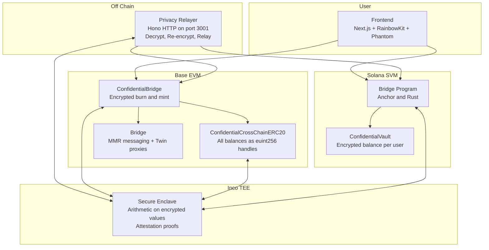
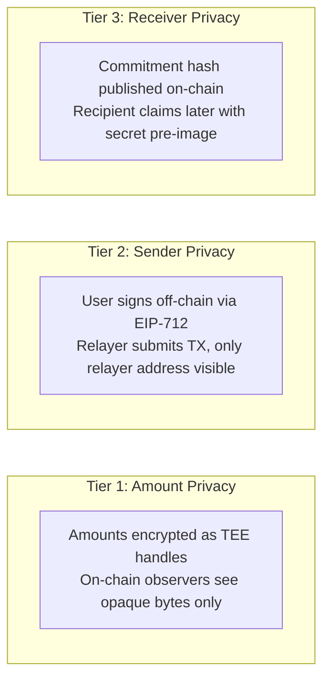
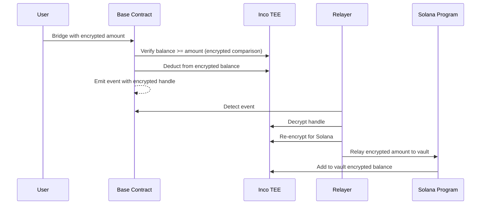
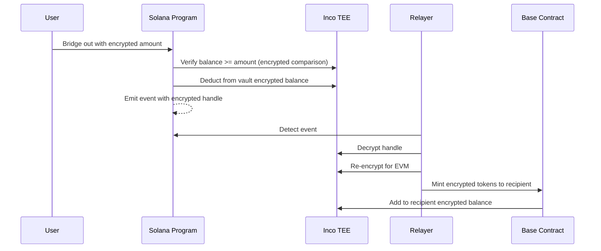
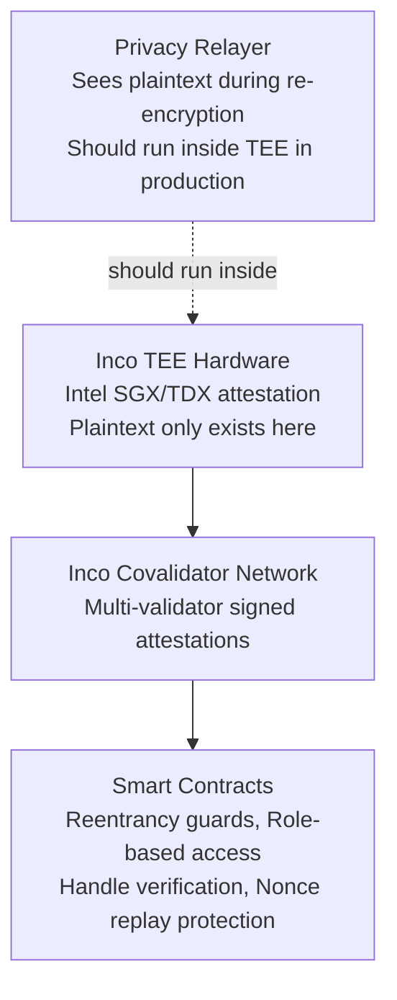

# DarkBridge

Privacy-preserving cross-chain bridge between **Base (Ethereum L2)** and **Solana**.

Transfer tokens across chains where amounts, balances, and identities stay hidden from on-chain observers. Powered by [Inco Lightning](https://www.inco.org/) TEE (Trusted Execution Environment) for encrypted computation inside secure hardware enclaves.

**Networks:** Base Sepolia (Testnet) <-> Solana Devnet | **Token:** cDARK

---

## How It Works

Users bridge tokens between Base and Solana. All amounts are encrypted on-chain as opaque "handles" -- references to private values stored inside Inco's TEE network. The relayer decrypts on one chain and re-encrypts for the other. Plaintext never appears on-chain.

---

## Privacy Tiers

DarkBridge provides three levels of privacy, usable independently or combined:

| What observers see | What is hidden |
|---|---|
| A bridge transfer occurred | Actual amount transferred |
| Encrypted handle reference | User balances before and after |
| Relayer address (Tier 2) | Real sender address |
| Commitment hash (Tier 3) | Real receiver address |

---

## Base to Solana Flow

---

## Solana to Base Flow

---

## Components

| Component | Location | What it does |
|---|---|---|
| **Base Contracts** | `base/` | Solidity (Foundry). ConfidentialBridge handles encrypted bridging with handle verification. ConfidentialCrossChainERC20 stores all balances as encrypted euint256 handles. Bridge handles standard MMR messaging and Twin execution proxies. |
| **Solana Programs** | `solana/` | Anchor/Rust. Bridge program with ConfidentialVault (encrypted balance per user per token, keyed by keccak256 of owner pubkey). Base Relayer program for EIP-1559 gas pricing. |
| **Privacy Relayer** | `scripts/` | Hono HTTP server on port 3001. Monitors bridge events on both chains, decrypts via Inco TEE, re-encrypts for the target chain, and submits relay transactions. Dockerized for production. |
| **Frontend** | `frontend/` | Next.js 14 app. Dual wallet support (RainbowKit for EVM, Phantom for Solana). Bridge interface, encrypted vault balance viewer, cDARK faucet. |
| **TypeScript SDK** | `clients/ts/` | Auto-generated Anchor IDL bindings for both Solana programs. Publishable as `@base/bridge`. |
| **Relayer Services** | `services/` | Standalone event watchers for each bridge direction (monitoring stubs). |

---

## Relayer API

The privacy relayer exposes these endpoints:

| Method | Endpoint | Description |
|---|---|---|
| GET | `/health` | Server status, relayer address, pending counts |
| POST | `/relay` | Base to Solana -- re-encrypt and relay to Solana vault |
| POST | `/relay-to-base` | Solana to Base -- re-encrypt and mint on Base |
| POST | `/relay-bridge-to-solana` | Sender-privacy variant (relayer submits Base TX) |
| POST | `/relay-bridge-out` | Sender-privacy variant (relayer submits Solana TX) |
| GET | `/status/:txHash` | Poll relay completion, returns target chain TX |
| GET | `/pending` | List unprocessed bridge events |

---

## Security Model

| Threat | Mitigation |
|---|---|
| Amount leakage | All amounts encrypted; only handles on-chain |
| Balance tracking | Balances are encrypted handles with per-address access control |
| Handle substitution | `expectedHandles[nonce]` verification prevents swap attacks |
| Replay attacks | Nonce tracking on both chains |
| Unauthorized decryption | Explicit `allow()` grants required; TEE enforces |
| Sender correlation | EIP-712 meta-transactions via relayer |
| Receiver correlation | Commitment-claim or encrypted address (eaddress) |

**Trust assumptions:** Inco TEE hardware integrity (verified via attestation), Inco covalidator availability, and that the relayer runs inside a TEE in production (it sees plaintext during re-encryption -- architecturally unavoidable).

---

## Deployed Addresses

### Base Sepolia

| Contract | Address |
|---|---|
| Bridge | `0x8e46419298a9620ea326113baf4019a23594bb11` |
| ConfidentialBridge | `0x04423E2D4e74b8C5D17730143400ca43fC800f73` |
| cDARK Token | `0xeC7f5bDafE9934658d717E9a13Ae4259858b5F0b` |
| BridgeValidator | `0x9fc354b36a6a1da0c1dBdcE2fc73793eAb6FC462` |

### Solana Devnet

| Program | Address |
|---|---|
| Bridge Program | `EEMKRm1ANMBZHS6yEi67bKVuZDPhztQHVWBzoFnoVbh9` |
| Base Relayer | `BGrkLkS3VZLxkM8PtKJukYYXQW1N3mPJaL3PPXieLQi9` |
| Inco Lightning | `5sjEbPiqgZrYwR31ahR6Uk9wf5awoX61YGg7jExQSwaj` |
| cDARK Mint | `3JWs353tgpFRVxb6Ubi85hDm5eBsbGrJFmVqNS8t6V3V` |

---

## Tech Stack

| Layer | Technologies |
|---|---|
| EVM contracts | Solidity 0.8.28, Foundry, Solady, @inco/lightning |
| Solana programs | Rust, Anchor 0.30.x, inco-lightning CPI |
| Frontend | Next.js 14, TypeScript, RainbowKit, Wallet Adapter, Tailwind, Framer Motion |
| Relayer | Bun, Hono, viem, @solana/web3.js, @inco/js, @inco/solana-sdk |
| Infra | Docker, AWS ALB, CloudFront |

---

## Quick Start

1. Install dependencies in each workspace (`bun install` in frontend, scripts, clients/ts, solana; `forge install` in base)
2. Set up `.env` files with EVM and Solana private keys, contract addresses, and Inco config
3. Run the frontend: `cd frontend && bun run dev`
4. Run the relayer: `cd scripts && EVM_PRIVATE_KEY=0x... bun run src/privacy-relayer-server.ts`
5. Open `http://localhost:3000`, connect both wallets, and bridge

---

## License

MIT
